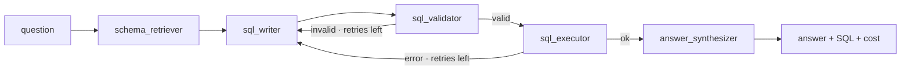

<div align="center">

# PromptDB

**Ask your database in English.** A production text-to-SQL agent built on LangGraph — it reads your schema, writes a read-only query, self-corrects on error, runs it, and explains the answer.

[**Live demo → promptdb-ai.vercel.app**](https://promptdb-ai.vercel.app) · [Architecture](docs/ARCHITECTURE.md) · [Use your own database](docs/CONNECTOR.md) · [Changelog](CHANGELOG.md)

  -555) 

</div>

---

PromptDB turns a plain-English question into the **exact SQL**, the **result table**, and a **written answer** — and shows all three, because the SQL is the proof. It scores **69.3% on the Spider dev set** with strict execution matching, runs every query **read-only**, and **self-corrects**: a validation or execution error routes back to the writer with the error in context until it succeeds or hits the retry cap.

```text
$ promptdb ask "which 3 genres have the most tracks?"
SELECT g.Name, COUNT(t.TrackId) AS n FROM Genre g
JOIN Track t ON g.GenreId = t.GenreId GROUP BY g.GenreId ORDER BY n DESC LIMIT 3

 Genre   n
 Rock    1297
 Latin    579
 Metal    374

Rock dominates with 1,297 tracks, ahead of Latin (579) and Metal (374).
· 1.98s · $0.00222 · 1 attempt
```

## The live demo

[**promptdb-ai.vercel.app**](https://promptdb-ai.vercel.app) runs against a **real project's database** — the
[FireScope](https://firescope.netlify.app) wildfire app (14 tables: users, roles, alerts, news, risk/feature
caches) — so you see the agent working on a genuinely complex schema, not a toy. In the browser you can:

- **Query the demo** instantly — a worked example loads on arrival; click a chip or type your own.
- **Connect your own database** — paste a read-only Postgres/MySQL connection string and the hosted
  agent queries it (SSRF-guarded), or run the local connector for a DB on your laptop / private network.
- **Pick any model** — the demo key (5 free queries, metered per browser), or bring your own:
  **OpenRouter** (one key → hundreds of models including every open-source one), OpenAI, Anthropic,
  or a custom OpenAI-compatible endpoint. The model list is fetched live.
- **Get unstuck** — connect a DB and it suggests questions grounded in *your* schema; if a question
  returns nothing, the agent surfaces the column's real values ("did you mean…") instead of failing silently.

For a private database, the agent runs **where the data lives** (the [MCP](https://modelcontextprotocol.io)
connector pattern) — credentials and rows never leave your machine. Demo data is served read-only with
credential columns (e.g. `password_hash`) blocked. See [SECURITY.md](SECURITY.md).

## Results

| Benchmark | Metric | Result |
|---|---|---|
| **Spider dev sample (150 Q)** | strict execution accuracy | **69.3%** (104/150) · $0.0038/query |
| Chinook gold set (12 Q) | execution accuracy (subset-tolerant) | 100% (12/12) |

Model trade-off on the gold set (pick per request):

| Model | Accuracy | Cost / query | Latency |
|---|---|---|---|
| `claude-sonnet-4-6` | 100.0% | $0.00539 | 2.6s |
| `claude-haiku-4-5` | 91.7% | $0.00177 | 1.1s |

Reproduce: [`python -m evals.run_spider 150`](evals/run_spider.py) and [`python -m evals.compare_models`](evals/compare_models.py).

## Architecture

A LangGraph state machine with a self-correction loop. The model is resolved per request, so the
demo runs on the server key while a caller can bring their own provider and key.



**Read-only by design.** The validator allows only single `SELECT`/`WITH` statements and blocks
`INSERT/UPDATE/DELETE/DROP/…`; the connection is opened read-only (a `DROP` raises at the driver);
queries carry a statement timeout and a row cap. The agent cannot modify data. Full write-up in
[docs/ARCHITECTURE.md](docs/ARCHITECTURE.md).

**Hosted topology.** UI on Vercel (Next.js), agent API on Render (FastAPI). The model is resolved
per request — the demo runs on the server key (free queries metered **per browser** via a client id,
plus a global daily spend ceiling), while bring-your-own-key requests bypass the cap and never enter
graph state or traces. New endpoints: `/connect` and `/sample` (schema + queries on a connected/sample
DB), `/models` (live model list), `/suggest` (schema-grounded starter questions). User connection
strings and model `base_url`s are SSRF-guarded; demo credential columns are blocked at the query layer.

## Quickstart

```bash
python3 -m venv .venv && source .venv/bin/activate
pip install -e ".[dev,web,providers]"
cp .env.example .env                       # add ANTHROPIC_API_KEY
curl -sSL -o chinook.db "https://github.com/lerocha/chinook-database/raw/master/ChinookDatabase/DataSources/Chinook_Sqlite.sqlite"
promptdb ask "how many customers are there?"
```

## Usage

**CLI (flagship)**
```bash
promptdb ask "which countries have more than 5 customers?"
promptdb schema      # Mermaid ER diagram from introspection
promptdb profile     # row counts, null %, distinct counts (read-only)
promptdb doctor      # data-quality issues: orphaned FKs, empty tables, high-null columns
```

**Your own database** — point the connector at any SQL database; the data stays local:
```bash
PROMPTDB_DATABASE_URL="sqlite:///./mystore.db" promptdb ask "top 5 products by revenue"
# or plug `promptdb-mcp` into Claude Desktop / Cursor — see docs/CONNECTOR.md
```

**Bring your own model** — any OpenAI-compatible endpoint, so effectively any model:
```bash
# OpenRouter — one key, hundreds of models including every open-source one
PROMPTDB_PROVIDER=openrouter PROMPTDB_MODEL=meta-llama/llama-3.3-70b-instruct  promptdb ask "..."
PROMPTDB_PROVIDER=openai     PROMPTDB_MODEL=gpt-4o-mini                        promptdb ask "..."
PROMPTDB_PROVIDER=ollama     PROMPTDB_MODEL=gemma2                             promptdb ask "..."  # local, $0
```
In the hosted UI the same choice is a picker (Demo key / OpenRouter / OpenAI / Anthropic / Custom) with a
live model dropdown. Local models (Ollama, vLLM) run through the connector, not the hosted server.

**Web / API**
```bash
uvicorn promptdb.api.main:app --reload     # http://localhost:8000  (POST /query, SSE /query/stream)
```

More runnable snippets in [`examples/`](examples/).

## Evals

```bash
python -m evals.run_evals          # Chinook gold set: accuracy, per-difficulty, cost
python -m evals.compare_models     # Sonnet vs Haiku accuracy/cost
python -m evals.run_spider 150     # Spider dev sample (questions: xlangai/spider, DBs: premai-io/spider)
```

Metric: execution accuracy (compare result sets, order-insensitive). Spider uses strict match for
comparability; the Chinook set uses column-subset tolerance. CI runs `pytest` on every push; the
paid eval suite runs on manual dispatch.

## Project layout

```
src/promptdb/
  agent/         LangGraph graph, state, guardrails, provider router
  db/            read-only connection + schema introspection
  data/          schema ER, profiling, data-quality (the "data copilot")
  api/           FastAPI app, demo spend caps
  mcp_server/    MCP server — the local connector
  cli/           Typer CLI
  observability/ token cost + LangSmith tracing
frontend/        Next.js blueprint UI (deploys to Vercel)
evals/           gold sets, evaluators, Spider runner
docs/            architecture, connector, design
examples/        runnable usage snippets
```

## Stack

Python · LangGraph + LangChain · Claude / OpenAI / Ollama · SQLAlchemy · MCP · Typer + Rich ·
FastAPI · Next.js · LangSmith · pytest · Docker · Render · Vercel · GitHub Actions.

## Documentation

- [Architecture](docs/ARCHITECTURE.md) — the agent graph, guardrails, provider router, hosted topology
- [Use your own database](docs/CONNECTOR.md) — the local connector, Claude Desktop, BYO model
- [Security](SECURITY.md) — read-only guarantees, data residency, key handling
- [Contributing](CONTRIBUTING.md) · [Changelog](CHANGELOG.md) · [Design system](docs/DESIGN.md)

## License

[MIT](LICENSE) © Ido Cohen
