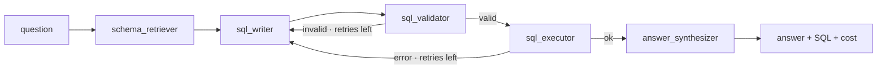

# Architecture

PromptDB is a LangGraph agent with a strict read-only contract, a per-request model router, and
two deployment shapes (a hosted demo and a local connector). This document covers how the pieces
fit together.

## The agent graph

A `StateGraph` (`src/promptdb/agent/graph.py`) with five nodes and a self-correction loop:



- **schema_retriever** introspects the database (tables, columns, foreign keys) into a compact
  text schema. No data rows are read here.
- **sql_writer** prompts the model for one read-only `SELECT`. On a retry it receives the previous
  SQL and the error, so the fix is grounded in what actually failed.
- **sql_validator** runs the static guardrail (below). A failure routes back to the writer.
- **sql_executor** runs the query read-only with a timeout and row cap. A driver error routes back
  to the writer with the message.
- **answer_synthesizer** writes a 1–3 sentence answer from the result table only.

Routing is conditional on `error` and `attempts`; after `MAX_ATTEMPTS` the synthesizer reports the
last error instead of looping forever.

## Read-only contract

Three independent layers, any one of which is sufficient:

1. **Validator** (`agent/guardrails.py`) — single `SELECT`/`WITH` only; blocks stacked statements
   and mutation keywords on word boundaries (so a column like `last_update` is fine).
2. **Connection** (`db/connection.py`) — SQLite opened `mode=ro`; mutations raise at the driver.
3. **Limits** — statement timeout (SQLite progress handler) and a row cap on fetch.

See [SECURITY.md](../SECURITY.md) for the threat model.

## Provider router — any model

`agent/providers.py` builds a chat model per request. Any **OpenAI-compatible endpoint** plugs in via
`base_url` + `api_key` + `model`, so effectively any model works: **OpenRouter** (one key, hundreds of
models including every open-source one), OpenAI, vLLM, llama.cpp, and local Ollama all expose an
OpenAI-style `/v1`. Native Anthropic is the demo default. Imports are lazy — the base install needs only
`langchain-anthropic`. `/models` lists a provider's catalog live (its `/models` route), SSRF-guarded.

The per-request client is injected through LangGraph's `config.configurable`, **not** `AgentState`,
so a bring-your-own key stays encapsulated in the client and out of graph state and LangSmith traces.
With no per-request config, nodes fall back to the env default (`get_llm()`) — CLI and evals unchanged.

`sql_writer` is **dialect-aware**: it reads the connected engine's dialect and tells the model to use
PostgreSQL / MySQL / SQLite syntax (so a connected Postgres DB doesn't get SQLite functions). Cost
lookup (`observability/cost.py`) prices Anthropic + OpenAI models and treats local families as free.

## Hosted topology

```
Browser ──HTTPS──> Vercel (Next.js UI) ──fetch──> Render (FastAPI agent API) ──> demo DB / connected DB (read-only)
```

- **UI** (`frontend/`) — Next.js app calling `NEXT_PUBLIC_API_BASE`; a per-browser client id (`X-Client-Id`)
  meters the demo quota per user. Interactive schema (GSAP) and a worked example shown on arrival.
- **API** (`api/main.py`) — `/query`, `/schema`, `/usage`, `/health`, plus `/connect` (validate + introspect
  a user DB), `/sample` (server-side demo DB), `/models` (live model list), `/suggest` (schema-grounded
  starter questions).
- **Demo DB** — a real external Postgres (the FireScope wildfire project), used server-side; only an
  allowlist of tables is exposed and credential columns (`password_hash`) are blocked at the query layer
  (`agent/guardrails.validate_credentials` + `validate_table_access`, wired via config).
- **Demo protection** (`api/limits.py`) — free-query count **per client id** + a global daily spend ceiling,
  persisted to a JSON file on a mounted disk. Bring-your-own-key requests bypass the spend cap.
- **SSRF** (`api/remote_db.py`) — user connection strings and model `base_url`s are resolved and rejected
  if they point at private/reserved/metadata addresses; a fast TCP probe fails unreachable hosts in seconds.

## Helpful failure

A 0-row result is the #1 "looks broken" moment. `sql_executor` detects a filtered query that returned
nothing and runs a quick lookup of the filtered column's real values; `answer_synthesizer` then says
"no rows matched `category='wildfire'`; the column actually contains updates, breaking, safety, research"
instead of vaguely reporting an empty table. On connect, `/suggest` hands the user questions grounded in
their schema so the first question is answerable.

## Local topology (your own database)

```
Your machine: MCP client (Claude Desktop / Cursor) <──stdio──> promptdb-mcp ──> your DB (read-only)
```

The connector runs where the data lives. Only schema and your own query results reach the model;
credentials and rows stay local. See [CONNECTOR.md](CONNECTOR.md).

## Evaluation

`evals/` shares the real `build_sql_prompt`, so evals measure the actual agent. Execution accuracy
compares result sets order-insensitively; Spider uses strict matching for comparability with
published numbers, the Chinook set uses column-subset tolerance.
