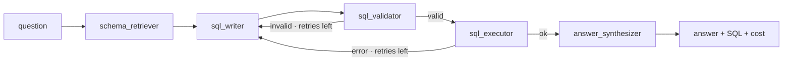

# Architecture

PromptDB is a LangGraph agent with a strict read-only contract, a per-request model router, and
two deployment shapes (a hosted demo and a local connector). This document covers how the pieces
fit together.

## The agent graph

A `StateGraph` (`src/promptdb/agent/graph.py`) with five nodes and a self-correction loop:



- **schema_retriever** introspects the database (tables, columns, foreign keys) into a compact
  text schema. No data rows are read here.
- **sql_writer** prompts the model for one read-only `SELECT`. On a retry it receives the previous
  SQL and the error, so the fix is grounded in what actually failed.
- **sql_validator** runs the static guardrail (below). A failure routes back to the writer.
- **sql_executor** runs the query read-only with a timeout and row cap. A driver error routes back
  to the writer with the message.
- **answer_synthesizer** writes a 1–3 sentence answer from the result table only.

Routing is conditional on `error` and `attempts`; after `MAX_ATTEMPTS` the synthesizer reports the
last error instead of looping forever.

## Read-only contract

Three independent layers, any one of which is sufficient:

1. **Validator** (`agent/guardrails.py`) — single `SELECT`/`WITH` only; blocks stacked statements
   and mutation keywords on word boundaries (so a column like `last_update` is fine).
2. **Connection** (`db/connection.py`) — SQLite opened `mode=ro`; mutations raise at the driver.
3. **Limits** — statement timeout (SQLite progress handler) and a row cap on fetch.

See [SECURITY.md](../SECURITY.md) for the threat model.

## Provider router

`agent/providers.py` builds a chat model per request from `(provider, model, api_key)` with lazy
imports — the base install needs only `langchain-anthropic`; OpenAI and Ollama load only if used.

The per-request client is injected through LangGraph's `config.configurable`, **not** through
`AgentState`. That keeps a bring-your-own key encapsulated in the model client and out of graph
state and LangSmith traces. With no per-request config, nodes fall back to the env-configured
default (`get_llm()`), so the CLI and the eval harness are unchanged.

Cost lookup (`observability/cost.py`) prices known Anthropic and OpenAI models and treats local
Ollama families (`gemma`, `llama`, `mistral`, …) as free.

## Hosted topology

```
Browser ──HTTPS──> Vercel (Next.js UI) ──fetch/SSE──> Render (FastAPI agent API) ──> Chinook (read-only)
```

- **UI** (`frontend/`) is a static Next.js app. It calls the API at `NEXT_PUBLIC_API_BASE`.
- **API** (`api/main.py`) exposes `/query`, `/query/stream` (SSE), `/schema`, `/usage`, `/health`.
- **Demo protection** (`api/limits.py`): a per-IP free-query count and a global daily spend ceiling
  on the server key, persisted to a JSON file on a mounted disk so counts survive restarts. A
  multi-instance host would swap the file for a shared store.
- Bring-your-own-key requests skip the spend cap (the visitor pays) and are bounded only by the
  per-IP rate limit.

## Local topology (your own database)

```
Your machine: MCP client (Claude Desktop / Cursor) <──stdio──> promptdb-mcp ──> your DB (read-only)
```

The connector runs where the data lives. Only schema and your own query results reach the model;
credentials and rows stay local. See [CONNECTOR.md](CONNECTOR.md).

## Evaluation

`evals/` shares the real `build_sql_prompt`, so evals measure the actual agent. Execution accuracy
compares result sets order-insensitively; Spider uses strict matching for comparability with
published numbers, the Chinook set uses column-subset tolerance.
